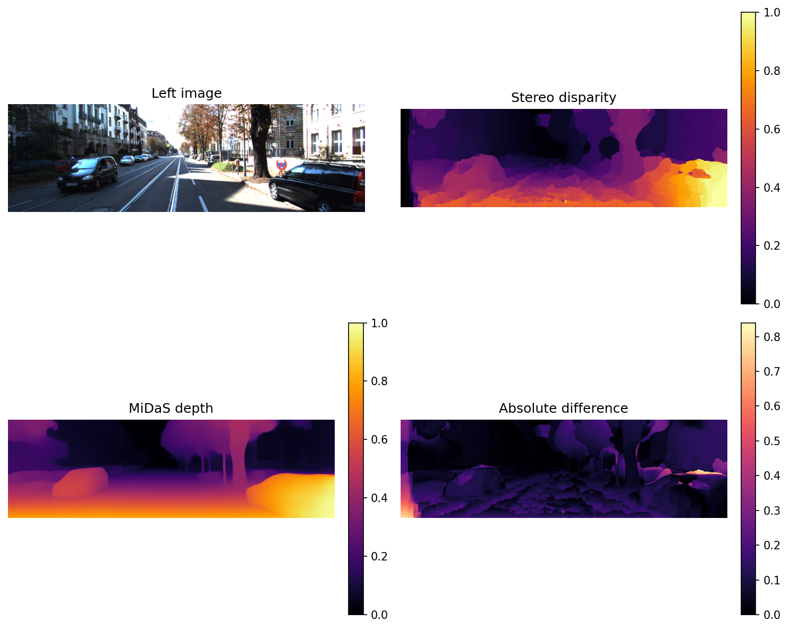
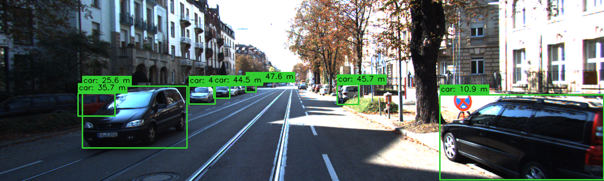

# CV Project 2

This project combines stereo depth estimation, MiDaS depth prediction, and YOLO-based object detection to estimate object distances in real-world scenes.

It is organized into two subtasks:

- Subtask 1 compares classical stereo matching against MiDaS depth on paired left/right images.
- Subtask 2 detects objects in the left images and estimates their distance from the MiDaS depth map.

## Repository Layout

- images/left and images/right contain the input image pairs.
- subtask1_depth.py generates MiDaS vs stereo heatmap comparisons.
- subtask2_distance.py detects objects and annotates each bounding box with an estimated distance.
- experiment_subtask1_compare.py and experiment_subtask2_hyperparams.py run batch evaluations and write summary files into outputs/.
- visualization.py, stereo_matching.py, and midas_utils.py provide the reusable processing code.
- outputs/ stores generated figures and CSV/JSON summaries.

## Setup

Create and activate a virtual environment, then install dependencies:

    pip install -r requirements.txt

The current dependency set is verified with Ultralytics 8.4.45, which is compatible with the bundled yolo26m.pt checkpoint.

## Running the Project

Generate the Subtask 1 visual comparisons:

    python subtask1_depth.py

Run the Subtask 2 distance annotation pipeline:

    python subtask2_distance.py

Run the comparison and hyperparameter experiments used to produce the summary files in outputs/:

    python experiment_subtask1_compare.py
    python experiment_subtask2_hyperparams.py

## Results

The generated figures in `outputs/` show the main outputs of the project.

### Subtask 1: MiDaS vs Stereo

This figure shows the left image, stereo disparity, MiDaS depth, and the absolute difference between the two depth estimates.

The saved comparison summaries indicate that the best tested stereo configuration was `w7_d96_a9`, with the lowest average MAE and RMSE among the tested settings.

### Subtask 2: Object Distance Estimation

This figure overlays YOLO detections on the input image and labels each object with an estimated distance in meters.

The hyperparameter summary shows that the baseline configuration detects about 5.75 objects per image on average, with all detections producing valid distance estimates in the saved sample runs.

## Output Files

The outputs/ folder includes:

- *_midas_vs_stereo_heatmap.png comparison figures for Subtask 1.
- *_yolo_midas.png annotated detection figures for Subtask 2.
- subtask1_compare_metrics.csv and subtask1_compare_summary.* for stereo vs MiDaS evaluation.
- subtask2_hyperparam_metrics.csv and subtask2_hyperparam_summary.* for detection and distance hyperparameter evaluation.

## Notes

- Subtask 1 uses MiDaS as a learned monocular depth estimator and a stereo matching pipeline for classical comparison.
- Subtask 2 converts the normalized MiDaS depth map into a meter-scale estimate using a simple near/far mapping and then samples the depth inside each YOLO bounding box.
- Results are sensitive to scene structure, calibration quality, occlusions, and the quality of the MiDaS depth prediction.
